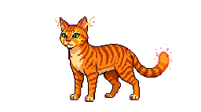
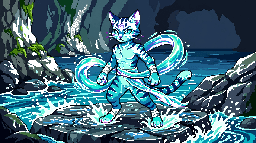
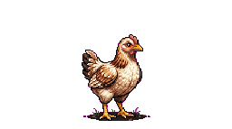
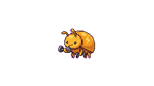

# Pocket Monster

[](https://nodejs.org/)
[](https://www.typescriptlang.org/)
[](https://vitejs.dev/)

瀏覽器上的**電子寵物養成**與**匿名房間碼連線對戰**（Socket.IO 回合制）。前端為 Vite + TypeScript，後端為單檔 Express + Socket.IO。


---

## 畫面與美術示意

以下使用倉庫內已存在的精靈 PNG 作示意；若要改成真實 UI 截圖，請見 [`docs/readme/IMAGES.md`](docs/readme/IMAGES.md)。

| 雷系奇獸（idle） | 雷貓進化（idle） | 水晶蛋 |
|:---:|:---:|:---:|
|  |  |  |

| 水貓進化 | 暖陽雞 | 訓練（雷系） |
|:---:|:---:|:---:|
|  |  |  |

> **狗**物種在遊戲內為 **Canvas 像素繪製**，沒有對應 idle PNG；圖鑑與養成畫面會即時畫出。

---

## 功能一覽

- **養成**：飢餓、心情、清潔、體力、訓練、虛擬日齡、生病與照護；本機 `localStorage` 存檔。
- **孵化**：部分物種從蛋開始，破殼後才參與對戰與訓練。
- **進化分支**：首次形態（含貓／狗屬性分支、大便怪路線等）；規則見 [`docs/GAME_RULES.md`](docs/GAME_RULES.md)。
- **連線對戰**：三位數字房間碼開房／加入、`strike`／`guard`／`charge` 回合制、投降與斷線處理；對戰中可送**預設快捷語**（非自由打字聊天）。
- **圖鑑**：物種分頁、成長階段與照護姿勢；貓／狗屬性變體可摺疊檢視。

---

## 本機開發

```bash
npm install
npm run dev
```

- 前端預設 **http://localhost:5173**
- 後端預設 **http://localhost:3000**（Vite 會將 `/socket.io` 代理到後端）
- 僅前端：`npm run dev:client`；僅後端：`npm run dev:server`

建置與本機生產模式：

```bash
npm run build
npm run start
```

僅 API（靜態改由 GitHub Pages 等託管時）：`npm run start:api`

---

## 環境變數（摘要）

| 變數 | 說明 |
|------|------|
| `VITE_SOCKET_URL` | 生產建置時 Socket 伺服器 origin（開發可留空走 proxy） |
| `VITE_FEEDBACK_URL` / `VITE_FEEDBACK_EMAIL` | 選填，意見回饋連結 |
| `PORT` | 後端埠，預設 `3000` |
| `SERVE_STATIC=0` | 僅 API，不提供 `dist` |

完整範例見 [`deploy.env.example`](deploy.env.example)。

---

## 部署形態（簡述）

1. **前後同源**：`npm run build` 後 `npm run start`，由同一 Node 服務靜態 + Socket。
2. **分離部署**：靜態站（例如 GitHub Pages）建置時注入 `VITE_SOCKET_URL`；後端以 `start:api` 跑在 Render 等，見 [`render.yaml`](render.yaml) 與 [`AGENTS.md`](AGENTS.md)。

---

## 專案結構（精簡）

| 路徑 | 用途 |
|------|------|
| [`src/main.ts`](src/main.ts) | 主要 UI、Socket 客戶端 |
| [`src/pet.ts`](src/pet.ts) | 狀態、存檔、進化與照護邏輯 |
| [`src/canvasDog.ts`](src/canvasDog.ts) | 狗：Canvas 繪製 |
| [`src/canvasPoop.ts`](src/canvasPoop.ts) | 大便怪 Canvas |
| [`server/index.js`](server/index.js) | HTTP + Socket 房間與戰鬥 |
| [`public/pets/`](public/pets/) | 精靈 PNG |
| [`docs/GAME_RULES.md`](docs/GAME_RULES.md) | 遊戲規則（給玩家／維護者） |

維護者導覽與 Socket 事件表：**[`AGENTS.md`](AGENTS.md)**。版號以 **`package.json` 的 `version`** 為準。

---

## 資產與授權

- 精靈圖為專案內原創用途資產；更換 PNG 後可執行 `npm run optimize:pets` 以控制體積（見 [`AGENTS.md`](AGENTS.md) 與 `.cursor/rules`）。
- 若本倉未附 `LICENSE` 檔，使用前請自行與維護者確認授權條款。

---

## 相連文件

- [遊戲規則 `docs/GAME_RULES.md`](docs/GAME_RULES.md)
- [路線與待辦 `docs/ROADMAP_TASKS.md`](docs/ROADMAP_TASKS.md)
- [改善備忘 `docs/IMPROVEMENT_BACKLOG.md`](docs/IMPROVEMENT_BACKLOG.md)
