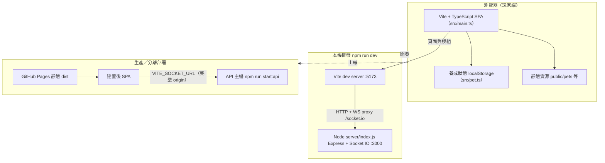
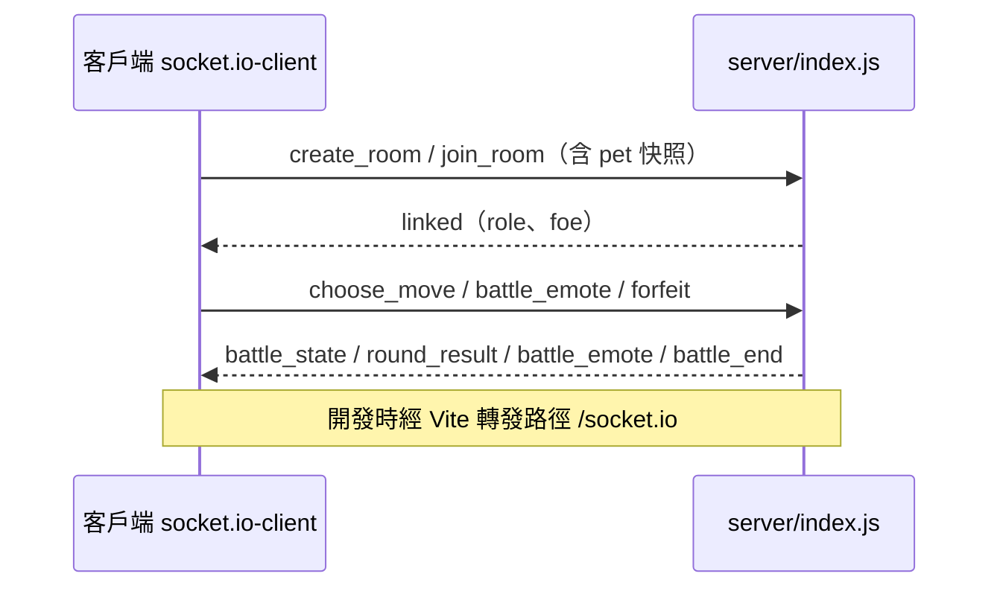

# 系統架構（維護者）

本文件以圖示摘要 **前端（Vite + TypeScript）**、**後端（Express + Socket.IO）**、**靜態資源** 與 **常見部署形態** 的關係。事件名稱與 payload 仍以 **`AGENTS.md`** 的 Socket 協定為準；玩法與數值規則以 **`docs/GAME_RULES.md`** 為準。

在 GitHub／支援 Mermaid 的編輯器預覽本檔即可渲染圖表。

---

## 1. 整體分層（瀏覽器 ↔ 本機開發 ↔ 生產）



---

## 2. 前端模組關係（精簡）

```mermaid
flowchart LR
  main["src/main.ts 照護／大廳／戰鬥 UI"]
  pet["src/pet.ts 狀態／進化／idle 路徑"]
  dog["src/canvasDog.ts 狗 Canvas"]
  poop["src/canvasPoop.ts 大便怪等 Canvas"]
  style["src/style.css"]
  rules["遊戲說明 gameRulesContent.ts 節錄 GAME_RULES"]

  main --> pet
  main --> dog
  main --> poop
  main --> style
  main --> rules
```

---

## 3. 對戰即時通道（Socket 層）



---

## 開發與上線差異（摘要）

| 情境 | 前端 | Socket |
|------|------|--------|
| `npm run dev` | Vite `:5173` | 瀏覽器連同源 `/socket.io`，由 Vite **proxy** 至後端 `:3000` |
| 靜態站 + 分離後端 | 託管 `dist/` | 建置時注入 `VITE_SOCKET_URL` 指向 API 的 HTTPS origin |

同機前後同源時可使用 `npm run start`（靜態 + Socket 同一 Node 行程），見 `AGENTS.md` 建置與生產跑法。
